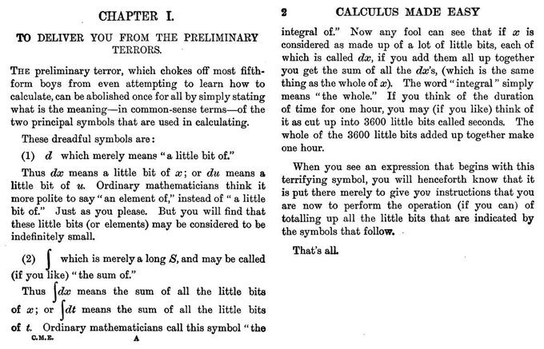

# SOC3070 Análisis de Datos Categóricos

Este repositorio contiene el material del curso SOC3070 Análisis de Datos Categóricos, dictado el segundo semestre 2022 a estudiantes de postgrado del Departamento de Sociología de la Universidad Católica de Chile. Para mayores detalles ver el [`[programa]`](files/syllabus_soc3070.pdf) y [`[calendario]`](#Calendario) del curso.

## Contenidos

### Nivelación Matemática

- Repaso de pre-cálculo, especialmente funciones logarítmicas y exponenciales: [`[texto]`](files/pre_calculo.pdf).
- Introducción a derivadas: [`[texto]`](https://www.mathsisfun.com/calculus/derivatives-introduction.html)
- El concepto de integral: 

Cálculo en 2 páginas. "Calculus Made Easy", 1910:

---

## Calendario Clases

| Dia          | Mes  | Contenido                                             | Presentaciones | Entregas            | 
| ---:         | ---: | :---------------------------------------------------- | :------------- | :-------------      | 
| Lunes 8      | 8    | Presentación del curso                                | [`[Presentación]`](https://mebucca.github.io/cda_soc3070/slides/class_0/class_0#1) [`[Código]`](slides/class_0/class_0.Rmd)                 |                     |
| Lunes 8      | 8    | Basics teoría de la Probabilidad                      | [`[Presentación]`](https://mebucca.github.io/cda_soc3070/slides/class_1/class_1#1) [`[Código]`](slides/class_1/class_1.Rmd)                |                     |
| Martes 16     | 8    |             |                | Tarea corta 1 (6%)  |
| Lunes 22     | 8    | Probabilidad Condicional y Teorema Bayes              |   [`[Presentación]`](https://mebucca.github.io/cda_soc3070/slides/class_2/class_2#1) [`[Código]`](slides/class_2/class_2.Rmd)             | |
| Lunes 29     | 8    | Variables Aleatorias, Distribuciones Discretas y MLE  |    [`[Presentación]`](https://mebucca.github.io/cda_soc3070/slides/class_3/class_3#1) [`[Código]`](slides/class_3/class_3.Rmd)    [`[Bonus]`](https://mebucca.github.io/cda_soc3070/slides/class_4/class_4#1)        | Tarea corta 2 (6%)  |
| Lunes 5      | 9    | Tablas de contingencia                                |[`[Presentación]`](https://mebucca.github.io/cda_soc3070/slides/class_5/class_5#1) [`[Código]`](slides/class_5/class_5.Rmd)                | Tarea corta 3 (6%)  |                  
| Lunes 12     | 9    | Modelo Lineal de Probabilidad (LPM)                   | [`[Presentación]`](https://mebucca.github.io/cda_soc3070/slides/class_7/class_7#1) [`[Código]`](slides/class_7/class_7.Rmd)                 | Tarea corta 4 (6%)  |
| Lunes 26     | 9    | Regresión Logística: estructura teórica y MLE         | [`[Presentación]`](https://mebucca.github.io/cda_soc3070/slides/class_9/class_9#1) [`[Código]`](slides/class_9/class_9.Rmd)               |                     |
| Lunes 3      | 10   | Regresión Logística: interpretación de efectos        | [`[Presentación]`](https://mebucca.github.io/cda_soc3070/slides/class_10/class_10#1) [`[Código]`](slides/class_10/class_10.Rmd)               |                     |
| Lunes 17     | 10   | Regresión Logística: inferencia                       | [`[Presentación]`](https://mebucca.github.io/cda_soc3070/slides/class_11/class_11#1) [`[Código]`](slides/class_11/class_11.Rmd)               |  Trabajo 1 (20%)    |
| Lunes 24     | 10   | Regresión Logística: ajuste y predicción              |                |  Tarea corta 5 (6%) |
| Lunes 7      | 11   | Regresión Logística Multinomial                       |                |                     |
|              |      | Regresión Logística Ordenada                          |                |                     |
| Lunes 14     | 11   | Regresión Poisson                                     |                |                     |
| Lunes 21     | 11   | Consideraciones Finales                               |                |  Trabajo 2 (20%)    |
| Domingo 4    | 12   |                                                       |                | Trabajo Final (30%) |

## Calendario Ayudantías

| Dia          | Mes  | Contenido                                       | Presentaciones | Enlace           | 
| ---:         | ---: | :----------                                     | :------------- |   :------------- |
| Miércoles 10 | 8    | R Basics                                        | [`[Presentación1]`](ta/ta_1/ta_1.pdf) [`[Código1]`](ta/ta_1/ta_1.Rmd) [`[Presentación1.1]`](ta/ta_1/ta_1_2.pdf) [`[Código1.1]`](ta/ta_1/ta_1_2.Rmd)                |                | 
| Miércoles 17 | 8    | Lenguaje R                                      | [`[R script]`](ta/ta_2/ta_2.R)  [`[Base de datos]`](ta/ta_2/base_OCS.xlsx)         |   [`[Zoom]`](https://us02web.zoom.us/j/81771419396?pwd=cWZKR2dDVHZvZlpTb2VIUDdsL3hoUT09) [`[Descarga video]`](https://us02web.zoom.us/rec/share/H8_yxlFuCoxvU2tm7KiOCxhQgrq12vRJzW_r_3H9YFqxO85qn2qRruvrRnlnmEo3.wF-xnfJm2n3RQcGc)             |
| Miércoles 31 | 8    | Funciones y distribuciones en R                 | [`[Presentación]`](ta/ta_3/ta_3.pdf) [`[Código]`](ta/ta_3/ta_3.Rmd) [`[Base de datos]`](ta/ta_3/data_OCS.Rdata)              | [`[Zoom]`](https://us02web.zoom.us/j/82723687266?pwd=WU5pcmNqOGk0VTdYdStScHAvQmVUdz09) [`[Descarga video]`](https://us02web.zoom.us/rec/share/9OGfMKCpnbOInT_gtHSH_p39GsoNE1deUukhuuAu-7PowKcPZ7b9S7tKMzCulV4X.CT1mE9GX7qPwrQ6Z)   | 
| Miércoles 7  | 9    | Loops en R, medidas asociación                  |  [`[Presentación]`](ta/ta_4/ta_4.pdf) [`[Código]`](ta/ta_4/ta_4.Rmd)        | [`[Zoom]`](https://us02web.zoom.us/j/82000036979?pwd=cFNJeWIwSFE2bnpyMjE0KzRMQnBqdz09) [`[Descarga video]`](https://us02web.zoom.us/rec/share/dJC9k6BECq6Q-YnNvRm2sqcyyPFudaiQYA-c5qrN-yOgu7VqgUrqedbuV-UD_wqf.s4GCq267BHEjDMwf)  |
| Miércoles 14 | 9    | LPM y formulas regresión en R                   |  [`[Presentación]`](ta/ta_5/ta_5.pdf) [`[Código]`](ta/ta_5/ta_5.Rmd)             | 
| Miércoles 5  | 10   | Regresión logística en R                        | [`[Presentación]`](ta/ta_6/ta_6.pdf) [`[Código]`](ta/ta_6/ta_6.Rmd)  [`[Base de datos]`](ta/ta_6/data_OCS_2.RData)                | [`[Zoom]`](https://us02web.zoom.us/j/81187890211?pwd=bkswRmUrUk1mU1YzbTVNcWNTUkJlZz09) [`[Descarga video]`](https://us02web.zoom.us/rec/share/T8hNew7SG5mT1XX3BgJxdQUcebsmBGbs7l01REqukS2H6zEx42A218EYeYM8OvHy.krqgUrra2wtEXoXa)|
| Miércoles 19 | 10   | Bootstrap en R                                  |                | |
| Miércoles 9  | 11   | Regresión logística multinomial                 |                | |
| Miércoles 16 | 11   | Regresión Poisson                               |                | |
| Miércoles 30 | 11   | "Elevator speech" Trabajo final                 |                | |

---

## Evaluaciones

#### Tareas cortas

- Tarea 1: [`[TC1]`](homework/tc_1.pdf) [`[TC1.Rmd]`](homework/tc_1.Rmd) [`[Soluciones TC1]`](homework/tc_1_answers.pdf) [`[Soluciones TC1.Rmd]`](homework/tc_1_answers.Rmd)
- Tarea 2: [`[TC2]`](homework/tc_2.pdf) [`[TC2.Rmd]`](homework/tc_2.Rmd) [`[Soluciones TC2]`](homework/tc_2_answers.pdf) [`[Soluciones TC2.Rmd]`](homework/tc_2_answers.Rmd)
- Tarea 3: [`[TC3]`](homework/tc_3.pdf) [`[TC3.Rmd]`](homework/tc_3.Rmd) [`[Soluciones TC3]`](homework/tc_3_answers.pdf) [`[Soluciones TC3.Rmd]`](homework/tc_3_answers.Rmd)
- Tarea 4: [`[TC4]`](homework/tc_4.pdf) [`[TC4.Rmd]`](homework/tc_4.Rmd)
- Tarea 5: 

#### Trabajos

- Trabajo 1: [`[T1]`](https://mebucca.github.io/cda_soc3070/homework/t_1/t_1#1) 
- Trabajo 2: 

#### Trabajo Final

- Trabajo Final: 

---

## Recursos computacion

### Para usuarios de `R`

  - En el repositorio de mi curso de *procesamiento avanzado de datos en `R`* puedes encontrar todo el material necesario para aprender `R` desde cero [`[aquí]`](https://mebucca.github.io/dar_soc4001/).
  - Acá pueden encontrar un template para escribir en `RMarkdown` ([`[PDF]`](files/template_rmarkdown.pdf) y [`[.Rmd]`](files/template_rmarkdown.Rmd) ). El uso de `RMarkdown` no es obligatorio, pero es altamente recomendado para escribir sus tareas y trabajos. Hoja de ayuda [`[aquí]`](https://rstudio-pubs-static.s3.amazonaws.com/330387_5a40ca72c3b14824acedceb7d34618d1.html).
  - [`[StalkOverflow]`](https://stackoverflow.com/) tiene las respuestas a casi todas las preguntas.
 

 ### Para usuarios de `Stata`

 - Es este [`[link]`](https://stats.idre.ucla.edu/other/examples/icda/) pueden encontrar la implementación en `Stata` de los ejemplos usandos en (casi) todos los capítulos del libro de Alan Agresti, [`[Introduction to Categorical Data Analysis]`](https://www.amazon.com/Introduction-Categorical-Data-Analysis/dp/0471226181). 

---

