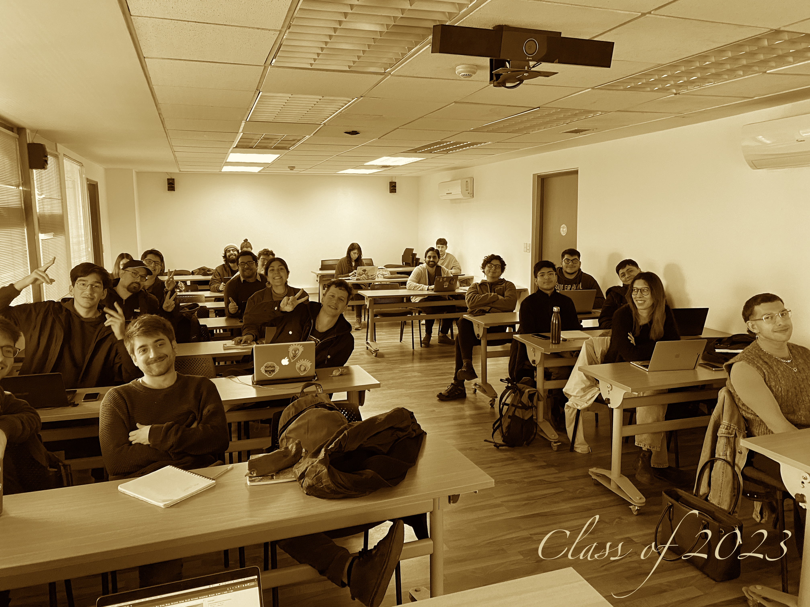

# SOC3070 Análisis de Datos Categóricos

Este repositorio contiene el material del curso SOC3070 Análisis de Datos Categóricos, dictado el segundo semestre 2023 a estudiantes de postgrado del Departamento de Sociología de la Universidad Católica de Chile. Para mayores detalles ver el [`[programa]`](files/syllabus_soc3070.pdf) y [`[calendario]`](#Calendario) del curso.

## Class of 2023

### Nivelación Matemática

- Repaso de pre-cálculo, especialmente funciones logarítmicas y exponenciales: [`[texto]`](files/pre_calculo.pdf).
- Introducción a derivadas: [`[texto]`](https://www.mathsisfun.com/calculus/derivatives-introduction.html)
- El concepto de integral, "Calculus Made Easy", 1910: [`[calculus]`](files/calculus_easy.jpg)

---

## Calendario

| Día | Mes        | Contenido                                        | Material                                                                                                                      |
|-----|------------|--------------------------------------------------|-----------------------------------------------------------------------------------------------------------------------------------|
| 7   | Agosto    | Presentación del curso                           | [`[Presentación]`](https://mebucca.github.io/cda_soc3070/slides/class_0/class_0#1) [`[Código]`](slides/class_0/class_0.Rmd)        |
| 7   | Agosto    | Basics teoría de la Probabilidad                 | [`[Presentación]`](https://mebucca.github.io/cda_soc3070/slides/class_1/class_1#1) [`[Código]`](slides/class_1/class_1.Rmd)        |
| 21  | Agosto    | Probabilidad Condicional y Teorema Bayes         | [`[Presentación]`](https://mebucca.github.io/cda_soc3070/slides/class_2/class_2#1) [`[Código]`](slides/class_2/class_2.Rmd)                                                                                                                                    |
| 21  | Agosto    | Variables Aleatorias, Distribuciones Discretas         |  [`[Presentación]`](https://mebucca.github.io/cda_soc3070/slides/class_3/class_3#1) [`[Código]`](slides/class_3/class_3.Rmd)                                                                                                                                 |
| 28  | Agosto    | Momentos y MLE |      [`[Presentación]`](https://mebucca.github.io/cda_soc3070/slides/class_4/class_4#1) [`[Código]`](slides/class_4/class_4.Rmd)                                                                                                                            |
| 4   | Septiembre | Tablas de contingencia y medidas de asociación                      |   [`[Presentación]`](https://mebucca.github.io/cda_soc3070/slides/class_5/class_5#1) [`[Código]`](slides/class_5/class_5.Rmd)                                                                                                                                |
| 11  | Septiembre | Modelo Lineal de Probabilidad (LPM)             |   [`[Presentación]`](https://mebucca.github.io/cda_soc3070/slides/class_6/class_6#1) [`[Código]`](slides/class_6/class_6.Rmd)                                                                                                                                |
| 25  | Septiembre | Modelos Lineales Generalizados   |  [`[Presentación]`](https://mebucca.github.io/cda_soc3070/slides/class_7/class_7#1) [`[Código]`](slides/class_7/class_7.Rmd)                                                                                                                                 |
| 16  | Octubre   | Regresión Logística: estructura teórica y MLE  |                                                                                                                                   |
| 23  | Octubre   | Regresión Logística: interpretación de efectos  |                                                                                                                                   |
| 30  | Octubre   | Regresión Logística: inferencia                 |                                                                                                                                   |
| 6   | Noviembre | Regresión Logística: ajuste y predicción        |                                                                                                                                   |
| 13  | Noviembre | Regresión Logística Multinomial                 |                                                                                                                                   |
| 20  | Noviembre | Regresión Poisson                               |                                                                                                                                   |
| 27  | Noviembre | Consideraciones Finales                         |                                                                                                                                   |

## Ayudantías

[Link](https://teams.microsoft.com/l/meetup-join/19%3ameeting_MjhlMzAyNzEtNjBiMS00ZWEyLThhMzgtYzQzZmRjNTZhMzQ5%40thread.v2/0?context=%7b%22Tid%22%3a%225ff5d9fa-f83f-4ac1-a4d2-eb48ea0a00d2%22%2c%22Oid%22%3a%22a6901aad-8777-4578-9043-5b080d1bcde8%22%7d) permanente de de las ayudantías. Recuerden que se realizaran en el primer modulo, es decir, todos los miércoles entre 12:20 y 13:30 hrs. 

| Día | Mes         | Contenido                                 | Material |
|-----|-------------|-------------------------------------------|------------|
| 16  | Agosto      | R                                         |            |
| 23  | Agosto      | R                                         | [`[Presentación]`](https://mebucca.github.io/cda_soc3070/ayudantia/01_prob/index) [`[Código]`](https://github.com/mebucca/cda_soc3070/blob/gh-pages/ayudantia/01_prob/index.qmd) | 
| 30  | Agosto      | R                                         | [`[Presentación]`](https://mebucca.github.io/cda_soc3070/ayudantia/02_prob/index) [`[Código]`](https://github.com/mebucca/cda_soc3070/blob/gh-pages/ayudantia/02_prob/index.qmd) |
| 6   | Septiembre  | R                                         | [`[Presentación]`](https://mebucca.github.io/cda_soc3070/ayudantia/03_manipulacion/index) [`[Código]`](https://github.com/mebucca/cda_soc3070/blob/gh-pages/ayudantia/03_manipulacion/index.qmd) |
| 13  | Septiembre  | Regresión lineal, LPM                     | [`[Presentación]`](https://mebucca.github.io/cda_soc3070/ayudantia/04_ols_lpm/index) [`[Código]`](https://github.com/mebucca/cda_soc3070/blob/gh-pages/ayudantia/04_ols_lpm/index.qmd) |
| 20  | Septiembre  | Regresión logística                       | [`[Presentación]`](https://mebucca.github.io/cda_soc3070/ayudantia/05_regresion_logistica/index) [`[Código]`](https://github.com/mebucca/cda_soc3070/blob/gh-pages/ayudantia/05_regresion_logistica/index.qmd) |
| 27  | Septiembre  | Regresión logística                       | [`[Presentación]`](https://mebucca.github.io/cda_soc3070/ayudantia/ayudantia/06_regresion_logistica%20II/index) [`[Código]`](https://github.com/mebucca/cda_soc3070/blob/gh-pages/ayudantia/06_regresion_logistica%20II/index.qmd) |
| 25  | Octubre     | Bootstrap y cross-validation              |            |
| 8   | Noviembre   | Regresión logística multinomial           |            |
| 22  | Noviembre   | Regresión logística ordenada y poisson    |            |
| 29  | Noviembre   | Sobre trabajo final                       |            |

## Horario de Consulta

- Reuniones individuales de aproximadamente 15 minutos cada día Lunes entre 15:00 y 16:00pm. [`[Agendar]`](https://calendar.app.google/A9vxmbBz1LyDQPAK6)

## Evaluaciones

|               |     Asignación      |     Entrega      |                 Material                  |
|---------------|---------------------|------------------|-------------------------------------------|
| Tarea corta 1 | 7 agosto            | 15 agosto        | [`[Soluciones TC1]`](homework/tc_1_answers.pdf) [`[Soluciones TC1.qmd]`](homework/tc_1_answers.qmd) |
| Tarea corta 2 | 21 agosto           | 29 agosto        | [`[Soluciones TC2]`](homework/tc_2_answers.pdf) [`[Soluciones TC2.qmd]`](homework/tc_2_answers.qmd) |
| Tarea corta 3 | 28 agosto           | 5 septiembre     | [`[Soluciones TC3]`](homework/tc_3_answers.pdf) [`[Soluciones TC3.qmd]`](homework/tc_3_answers.qmd) |
| Tarea corta 4 | 11 septiembre       | 20 septiembre    | [`[TC4]`](homework/tc_4.pdf) [`[TC4.qmd]`](homework/tc_4.qmd)                                       |
| Trabajo 1     | 16 octubre          | 31 octubre       |                                           |
| Tarea corta 5 | 30 octubre          | 7 noviembre      |                                           |
| Trabajo 2     | 13 noviembre        | 28 noviembre     |                                           |
| Trabajo final | 20 noviembre        | 5 diciembre      |                                           |

## Recursos computacion

### Para usuarios de `R`

  - En el repositorio de mi curso de *procesamiento avanzado de datos en `R`* puedes encontrar todo el material necesario para aprender `R` desde cero [`[aquí]`](https://mebucca.github.io/dar_soc4001/).
  - Acá pueden encontrar un template para escribir en `RMarkdown` ([`[PDF]`](files/template_rmarkdown.pdf) y [`[.Rmd]`](files/template_rmarkdown.Rmd) ). El uso de `RMarkdown` no es obligatorio, pero es altamente recomendado para escribir sus tareas y trabajos. Hoja de ayuda [`[aquí]`](https://rstudio-pubs-static.s3.amazonaws.com/330387_5a40ca72c3b14824acedceb7d34618d1.html).
  - [`[StalkOverflow]`](https://stackoverflow.com/) tiene las respuestas a casi todas las preguntas.
 

 ### Para usuarios de `Stata`

 - Es este [`[link]`](https://stats.idre.ucla.edu/other/examples/icda/) pueden encontrar la implementación en `Stata` de los ejemplos usandos en (casi) todos los capítulos del libro de Alan Agresti, [`[Introduction to Categorical Data Analysis]`](https://www.amazon.com/Introduction-Categorical-Data-Analysis/dp/0471226181). 

---

