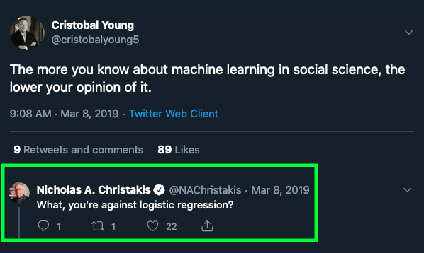

## Sobre mi

  - Profesor Asistente, Sociología UC

--

  - Max Weber Postdoctoral Fellow, European University Institute, Firenze
  
  - PhD en Sociología, Cornell University, NY
    - PhD Minor en Estadística, Departamento de Estadística, Cornell University

--

  - Investigación: movilidad social intergeneracional,  desigualdades en el mercado laboral, creencias sobre las desigualdades, métodos cuantitativos
  
  - Métodos: modelación estadística, estrategias empíricas para inferencia causal, métodos experimentales y computacionales
    - Datos categóricos: desarrollos en "log-linear models"

 
--

.bold[Información de contacto]
 - mail: mebucca@uc.cl
 - webpage: https://mebucca.github.io/

---
## Ayudantía

 

.pull-left[
.bold[Roberto Cantillán]

- Estudiante doctorado en Sociología PUC

- Investigador Núcleo Milenio para el Estudio de Desajustes del Mercado Laboral (LM²C²)

- Investigación: Desigualdades, sociología analítica, consolidación y homofilia, mercados laborales. 

- Métodos: Análisis de redes sociales, modelos multinivel, inferencia causal. 

]
.figure-right[

]

---
## Enseñanza de métodos cuantitativos

--

.pull-left[
- Los "atajos" estadísticos, tarde o temprano, dificultan el aprendizaje

]
.figure-right[

]
--

- Hay contenidos que hay que saber, la intuición no basta

--

$$e^{\alpha+\beta x} = e^{a} e^{\beta x}$$
--

- Muchas cosas parecen más difíciles de lo que son (notación, desconocimiento, miedo, etc.)

--

$$\mu = \int xf(x)dx$$

--

- Cosas aparentemente sencillas son más profundas de lo que parecen

--

$$ X \sim \mathcal{N}(\mu,\sigma)$$

---
## Enseñanza de métodos cuantitativos

   
.center[]

--

- Este curso nivela gaps de conocimiento. No hay cartas bajo la manga.

---
## Enseñanza de métodos cuantitativos

.pull-top[
.pull-left[
- Es más importante tener fundamentos sólidos que "conocer" muchos métodos distintos 

  - ej. logistic regression, ordered logistic regression, rank-order logistic regression, generalized ordered logistic regression ...
  ]

.pull-right[

]
]

 
--

.pull-bottom[
.pull-left[
- Los conceptos teóricos se aprenden poniéndolos en práctica, a mano
]
]

 
--

.pull-bottom[
.pull-left[
- Curso difícil en contenido, no en forma de evaluación
]
]

---

## Material del curso

Todo el material del curso será almacenado y actualizado regularmente en repositorio `Github`:

 
.center[

https://github.com/mebucca/cda_soc3070
]

---
class: inverse, center, middle

.huge[
**Hasta la próxima clase. Gracias!**
]

 
Mauricio Bucca  
https://mebucca.github.io/  
github.com/mebucca

