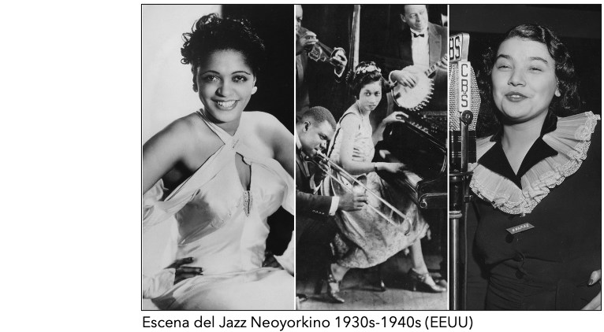

# A.- Tablas de Contingencia


---
# A.- Tablas de Contingencia

En esta sección trabajaremos sobre los datos de la **National Survey of Culture and the Arts 2018** coordinada por el *National Endowment for the Arts USA* con un muestreo representativo de la población de EEUU. La muestra contiene 8609 casos y variables demográficas, socioeconómicas y de consumo cultural. En esta ocación trabajaremos con 10 de ellas.

```{r echo=TRUE, comment='#'}
# Sintaxis
#Cargar base de datos
load("nsca2018.Rda")
```

---

# A.- Tablas de Contingencia

En esta sección trabajaremos sobre los datos de la **National Survey of Culture and the Arts 2018** coordinada por el *National Endowment for the Arts USA* con un muestreo representativo de la población de EEUU. La muestra contiene 8609 casos y variables demográficas, socioeconómicas y de consumo cultural. En esta ocación trabajaremos con 10 de ellas.

```{r echo=TRUE, comment='#'}
# Sintaxis
#Exploración de datos
library(tibble)
tibble(data1)
```

---
# A.- Tablas de Contingencia

Justamente, una de las discusiones más recientes en los estudios interseccionales de las relaciones entre género y preferencias culurales se ha centrado en comprender las distribuciones de datos entre formas estéticas y tipo de afluencias de públicos. En este contexto, parece interesante explorar los registros de públicos en estados unidos en función del género de los asistentes a 6 clases de eventos  del calendario anual de ofertas culturalesv(conciertos de jazz, música clásica, opera, ballet, exposiciones de arte contemporáneo en museos, y compras de libros).


```{r echo=TRUE, comment='#'}
# Sintaxis
#Relaciones multivariadas (en este caso bivariadas)
ctable1 <- data1 %>% with(table(sexo,jazz))
print(ctable1)
```
---
# A.- Tablas de Contingencia

```{r echo=TRUE, comment='#'}
# Sintaxis
#Relaciones multivariadas (en este caso bivariadas)
ctable2 <- data1 %>% with(table(sexo,ballet))
print(ctable2)

ctable3 <- data1 %>% with(table(sexo,museos))
print(ctable3)
```
---
# A.- Tablas de Contingencia

```{r echo=TRUE, comment='#'}
# Sintaxis
#Relaciones multivariadas 
ctable4 <- data1 %>% with(table(raza,jazz))
print(ctable4)
```
---
# A.- Tablas de Contingencia

- Ejercicio:


---
# A.- Tablas de Contingencia

- Ejercicio:

Una de las discusiones más interesantes en la configuración de los mundos de arte musical en la cultura popular estadounidense, recientemente ha girado  en torno a la inversión simultanea entre *performers* y *públicos* en base a la composición de género de éstos. Dicha particularidad, observan investigadores en sociología de la música, resulta ser particularmente acentuada en la constitución de la música jazz. A diferencia de los años 1930s y 1940s, en que las mujeres eran las grandes protagonistas de los escenarios y los hombres eran el principal público, en la actualidad esta relación se habría invertido, dando como resultado el escazo protagonismo femenino en los escenarios, generando un desplazamiento de éstas hacia públicos. Se cree que hoy el principal público que asiste a eventos de música jazz, son mujeres.

Exploremos inicialmente esta relación en base a los públicos de jazz en el 2018 con **n=8609**:

**a.-** De acuerdo a la relación bivariada jazz|sexo, en 2018 ¿cuál era la probabilidad de haber encontrado una **mujer que haya asistido a eventos de jazz** y la probabilidad de haber encontrado un **hombre que haya asitido**?

**b.-** ¿Cuál era la probabilidad de haber sido un **hombre** y, de forma independiente, la probabilidad de haber sido alguien que **no asistió a eventos de jazz** en 2018?

**c.-** ¿Cuál era la probabilidad de que, **siendo una mujer estadounidense**, no **hayas asistido a un evento de jazz** en 2018?

---
# A.- Tablas de Contingencia

**a.-** De acuerdo a la relación bivariada jazz|sexo, en 2018 ¿cuál era la probabilidad de haber encontrado una **mujer que haya asistido a eventos de jazz** y la probabilidad de haber encontrado un **hombre que haya asitido**?

--

```{r echo=TRUE, comment='#'}
# Sintaxis
#Relaciones multivariadas (en este caso bivariadas)
ctable1 <- data1 %>% with(table(sexo,jazz))
print(ctable1)

# Distribución conjunta
joint_dis <- ctable1/sum(ctable1); joint_dis 
```
---
# A.- Tablas de Contingencia

**b.-** ¿Cuál era la probabilidad de haber sido un **hombre** y, de forma independiente, la probabilidad de haber sido alguien que **no asistió a eventos de jazz** en 2018?

--

```{r echo=TRUE, comment='#'}
#Sintaxis
#Distribución marginal de sexo 
margin_sexo <- apply(joint_dis,1,sum); margin_sexo 

#Distribución marginal de jazz 
margin_jazz <- apply(joint_dis,2,sum); margin_jazz

```
---
# A.- Tablas de Contingencia

**c.-** ¿Cuál era la probabilidad de que, **siendo una mujer estadounidense**, no **hayas asistido a un evento de jazz** en 2018?

--

```{r echo=TRUE, comment='#'}
#Sintaxis
#Distribucuiones condicionales
ctable1 <- data1 %>% with(table(sexo,jazz)) # relacion bivariada como tabla de contingencia
joint_sexo_jazz <- ctable1/sum(ctable1) #distribución conjunta de las variables
margin_sexo <- apply(joint_sexo_jazz,1,sum) # distribución marginal de sexo
joint_sexo_jazz/margin_sexo #distribución condicional de jazz dado sexo 
```
---
# B.- Medidas de Asociación

```{r echo=TRUE, warning=FALSE, comment='#'}
library(tibble)
```

```{r echo=TRUE, comment='#'}
#Sintaxis
#Cargar base de datos
load("nsca2018.Rda")
tibble(data1)
```
---

# B.- Medidas de Asociación


---

# B.- Medidas de Asociación

En esta ocación estaremos trabajando sobre las medidas de asociación a través de la relación entre género y preferencias culurales, particularmente sobre las distribuciones de datos entre museos de arte contemporáneo y el tipo de afluencias de públicos que se observan en EEUU durante 2018.

```{r echo=TRUE, comment='#'}
# Sintaxis
#Relaciones multivariadas (en este caso bivariadas)
ctable1 <- data1 %>% with(table(sexo,museos))
print(ctable1)
```

**Recordatorio**: 

Tenemos independencia estadística si la ocurrencia de un evento no afecta la probabilidad de la ocurrencia de otro evento. Dicho de otro modo, la probabilidad de que ocurra $y$ es independiente de qué valor asume $x$. Por lo tanto, nos encontramos frente a independencia estadística si las probabilidades conjunta son iguales al producto de sus probabilidades marginales $P(XY) = P(X)P(Y)$. Las medidas de asociación nos permitirán justamente poder evaluar este escenario.
---

# B.- Medidas de Asociación

```{r echo=TRUE, comment='#'}
# Sintaxis
#Relaciones multivariadas (en este caso bivariadas)
ctable1 <- data1 %>% with(table(sexo,museos))
prop.table(ctable1,1)
```

**Recordatorio**

Sabemos que...

- $\delta = \mathbb{P}(Y=1 \mid X=1) - \mathbb{P}(Y=1 \mid X=0)$

- $RR=\frac{\mathbb{P}(Y=1 | X=1)}{\mathbb{P}(Y=1 | X=0)}$

- $\log \hat{\theta} = \log \frac{n_{11}n_{22}}{n_{12}n_{21}}$

---

# B.- Medidas de Asociación

.pull-left[
- **Contexto:**

En 2017 *Who does she think she is?* inauguró un interesante campo de discusión en torno al problema de la relación entre los públicos de arte y las diferencias de capital cultural de acuerdo al género de los amantes de los museos. Pamela Tanner notó a través de un set de numerosas entrevistas con mujeres artistas y visitantes de museos estadounidenses la persistente "generificación" de las artes visuales debido a la *dominación masculina* del sistema institucional de las artes en manos de hombres blancos, los cuales solo representan el 15% de los profesionales dentro del mundo de las artes. 

Así, parece interesante investigar la relación de asociación entre la asistencia a museos en Estados Unidos (los cuales concentran el 45% de las colecciones de arte contemporáneo del mundo) y el género de los públicos de arte. 
]


---

# B.- Medidas de Asociación

- Ejercicio:

```{r echo=FALSE, comment='#'}
# Sintaxis
#Relaciones multivariadas (en este caso bivariadas)
ctable1 <- data1 %>% with(table(sexo,museos))
prop.table(ctable1,1)
```

1) ¿Cuál es la diferencia de proporciones $\delta$ que se observa en la asistencia a museos durante 2018 en EEUU (*Y*) de acuerdo al género de los asistentes (*X*). Particularmente, la proporción de mujeres (*PM*) respecto a la de hombres (*PH*).
--
```{r echo=TRUE, comment='#'}
# Sintaxis
#Diferencia de proporciones
delta <- (0.267-0.226)
delta
```

--

R= Existe una diferencia de proporción de 0.041 entre mujeres en comparación con los hombres asistentes a museos.

---

# B.- Medidas de Asociación

- Ejercicio:

```{r echo=FALSE, comment='#'}
# Sintaxis
#Relaciones multivariadas (en este caso bivariadas)
ctable1 <- data1 %>% with(table(sexo,museos))
prop.table(ctable1,1)
```

2) ¿Cuál es el riesgo relativo $RR$ de que las mujeres asistan al museo en comparación con que los hombres asistan al museo?¿Existe una asociación?¿Es positiva o negativa?.
--
```{r echo=TRUE, comment='#'}
# Sintaxis
#Diferencia de proporciones
RR <- (0.267/0.226)
RR
RR_p <- (RR - 1)*100
RR_p
```
---

# B.- Medidas de Asociación

- Ejercicio

2) ¿Cuál es el riesgo relativo $RR$ de que las mujeres asistan al museo en comparación con que los hombres asistan al museo?¿Existe una asociación?¿Es positiva o negativa?.

R= El riesgo relativo de haber asistido a un museo de arte contemporáneo en 2018 es un 18% más alto para las mujeres en comparación con los hombres.

Sabemos que...

- Si $RR = 1$ no hay asociación entre la exposición al riesgo y el evento. 

- Si $RR > 1$ entonces la asociación es positiva. La exposición al riesgo está asociado a una mayor frecuencia del evento. 

- Lo contrario sucede si $RR < 1$, es decir estar expuesto al riesgo se asociado a una menor frecuencia del evento.

--

R= Considerando $Y$ (asistencia a museos) y $X$ (sexo), existe una asociación positiva en favor de mujeres sobre hombres asistentes a museos en 2018.
---

# B.- Medidas de Asociación

- Ejercicio

```{r echo=FALSE, comment='#'}
# Sintaxis
#Relaciones multivariadas (en este caso bivariadas)
ctable1 <- data1 %>% with(table(sexo,museos))
ctable1
```

3) ¿Cuáles son las odds de que un hombre estadounidense no asistiera a un museo de arte contemporáneo en 2018? ¿Cuál es la razón de odds de asistir a museos de arte contemporáneo en 2018 entre ambos sexos?.

--

```{r echo=TRUE, comment='#'}
# Sintaxis
# Valor probabilístico de éxito
p <- (3030/(889+3030))

# Odds (P/1-P)
odds <- (p/(1-p)) 
odds
```
--

R= Las odds ("chances") de que un hombre estadounidense no asistiera a un museo de arte contemporáneo en 2018 son de 3.4.

---

# B.- Medidas de Asociación

- Ejercicio

3) ¿Cuáles son las odds de que un hombre estadounidense no asistiera a un museo de arte contemporáneo en 2018? ¿Cuál es la razón de odds de asistir a museos de arte contemporáneo en 2018 entre ambos sexos?.

Ahora bien, en una tabla de 2x2 la razón de odds $\theta$ es la razón de éxito en dos filas, o $\theta= \frac{odds1}{odds2}=\frac{P_1/(1-P_1)}{P_2/(1-P_2)}$

Sabemos que...


- Si $\theta=1$ hay igualdad de odds ("chances") y, por lo tanto, hay independencia entre variables.

- Si $\theta > 1$ entonces el éxito es más probable para el grupo en el numerador (hombres en este caso).

- Si $\theta < 1$ entonces el éxito es más probable para el grupo en el denominador (mujeres en este caso).

---

# B.- Medidas de Asociación

- Ejercicio

3) ¿Cuáles son las odds de que un hombre estadounidense no asistiera a un museo de arte contemporáneo en 2018? ¿Cuál es la razón de odds de asistir a museos de arte contemporáneo en 2018 entre ambos sexos?.

```{r echo=TRUE, comment='#'}
# Sintaxis
# Razón de Odds 
theta <- ((889/3030)/(1253/3437)) 
theta
theta_p <- (theta-1)*100
theta_p
```

--

R= Las odds de que un hombre haya asistido a un museo en 2018 son 0.8 veces las odds de una mujer. Es decir, son aproximadamente un 20% más bajas que las de las mujeres asistentes a museos en 2018.

---

# C.- Inferencia Estadística

Continuando con nuestros cálculos previos...

- Ejercicio Intervalos de Confianza


1) ¿Es posible afirmar que nuestro valor $\delta= 0.041$, que observa en la muestra una diferencia de proporciones en la asistencia a museos de acuerdo al género durante 2018, es estadísticamente significativo a un 99% de confianza?

```{r echo=TRUE, comment='#'}
# Sintaxis
#CI Diferencia de proporciones
pm <- 0.267
ph <- 0.226
se <-  sqrt((pm*(1 - pm))/4690 +  (ph*(1 - ph))/3919)
ci99_delta <-  c(li=(delta - 2.58*se), ls=(delta + 2.58*se)) 
print(ci99_delta)
```

--

R= La diferencia de proporciones observada es estadísticamente significativa a un 99% de confianza.

---

# C.- Inferencia Estadística

Continuando con nuestros cálculos previos...

- Ejercicio Intervalos de Confianza

2) ¿Es posible afirmar que nuestra razón de odds $\theta= 0.804$, que observa en la muestra la asistencia a museos de arte contemporáneo en 2018 entre ambos sexos, es estadísticamente significativo a un 99% de confianza? *Ojo*: Recuerde utilizar $log(\theta)$, pues su distribución simétrica y asíntotica es más cercana a una distribución normal (y podemos recurrir a todas sus ventajas).

```{r echo=TRUE, comment='#'}
# Sintaxis
# IC Log Razón de Odds 
log_theta <- log(theta)
se_log_theta <- sqrt(1/889+1/3030+1/1253+1/3437)
ci99_log_theta <- c(li=exp(log_theta - 2.58*se_log_theta), ls=exp(log_theta + 2.58*se_log_theta))
print(ci99_log_theta)
```
--

R= El $log(\theta)$ observado en la muestra es estadísticamente significativa a un 99% de confianza.
---

# C.- Inferencia Estadística

- Ejercicio Test $\chi^2$

1) ¿Es posible rechazar la $H_0$ que afirma la independencia estadística de la relación bivariada entre asistencia a los museos de arte contemporáneo y sexo de los asistentes en 2018? *Ojo*: Recordemos que en tablas de 2x2 la independencia estadística entre variables equivale a $H_0: \pi_{ij}=\pi_{i+}\pi_{+j}$, con una posible $H_1: \pi_{ij}\neq\pi_{i+}\pi_{+j}$  y que los grados de libertad están determinados por $df= (i-1)(j-1)$.

--
```{r echo=TRUE, comment='#'}
# Sintaxis
# Test Chi2 de independencia estadística
chisq.test(ctable1,correct = FALSE)
```
--

R= Con un valor $\chi^2 = 18.571$ y un $p=1.637e-05$ es posible rechazara $H_0$ y afirmar que no existe independencia estadística entre las variables en todos los niveles convencionales de confianza $p<0.001$, $p<0.01$, $p<0.05$. Hay asociación entre las variables. 

---
# Referencias Sugeridas:

• Laurie Hanquinet & Mike Savage (2016). Routledge International Handbook of the Sociology of Art and Culture. London: Routledge.

• Hadley Wickham (2015). Advanced R, CRC Press, Taylor & Francis Group, Boca Raton, FL. En https://adv-r.hadley.nz/

• Hadley Wickham and Garrett Grolemund (2017). R for Data Science. Import, Tidy, Transform, Visualize, and Model Data. O’Reilly Media, Inc.. En https://r4ds.had.co.nz/


---
class: inverse, center, middle

.huge[
**¡Hasta la próxima!**
]

 💻 📊 🎨🎻🎷 
 
<br>
Roberto Velázquez <br>
https://github.com/rovelazqu <br>


