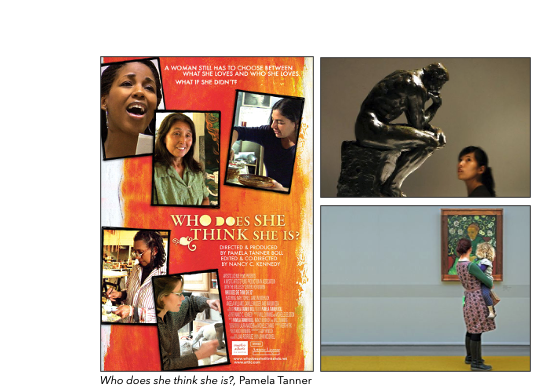

# A.- Lineal Probability Model (LPM)

Trabajemos sobre los datos de la **National Survey of Culture and the Arts 2018** vista en la ayudantía pasada. Recordemos que la encuesta fue coordinada por el *National Endowment for the Arts USA* con un muestreo representativo de la población de EEUU. La muestra contiene 8609 y 10 de variables de interés.


---

# A.- Lineal Probability Model (LPM)

.pull-left[
- **Contexto:**

En 2017 *Who does she think she is?* inauguró un interesante campo de discusión en torno al problema de la relación entre los públicos de arte y las diferencias de capital cultural de acuerdo al género de los amantes de los museos. Pamela Tanner notó a través de un set de numerosas entrevistas con mujeres artistas y visitantes de museos estadounidenses la persistente "generificación" de las artes visuales debido a la *dominación masculina* del sistema institucional de las artes en manos de hombres blancos, los cuales solo representan el 15% de los profesionales dentro del mundo de las artes. 

Así, parece interesante investigar la relación de asociación entre la asistencia a museos en Estados Unidos (los cuales concentran el 45% de las colecciones de arte contemporáneo del mundo) y el género de los públicos de arte. 
]



---

# A.- Lineal Probability Model (LPM)

- Codififación de variables y ajuste de LPM: 

```{r echo=TRUE, comment='#'}
#Sintaxis
#Nueva base de datos
library(tibble)
load("nsca2018.Rda")
tibble(data1)
```

---

# A.- Lineal Probability Model (LPM)

- Codififación de variables.

```{r echo=TRUE, message=FALSE, warning=FALSE, comment='#'}
library(tidyverse)
library(car)
```

```{r echo=TRUE, comment='#'}
# Sintaxis
#Conversión de factor a vector (tidyverse)
data1 <- data1 %>% 
  mutate(sexo_b = as.numeric(sexo))
data1 <- data1 %>% 
  mutate(museos_b = as.numeric(museos))
data1 <- data1 %>% 
  mutate(raza_b = as.numeric(raza))
#Codificación dummies (car)
data1$sexo_b <- recode(data1$sexo_b, "1=0; 2=1")
data1$museos_b <- recode(data1$museos_b, "1=1; 2=0")
data1$raza_b <- recode(data1$raza_b, "1=0; 2:26=1")
```

---


# B.- Lineal Probability Model (LPM)

-  Preguntas de interés:

  1) ¿Cuál es el efecto de la **edad** sobre la probabilidad de asistencia a museos de arte contemporáneo en 2018?

  2) ¿Cuál es el efecto de **sexo** sobre la probabilidad de asistencia a museos de arte contemporáneo en 2018?

  3) ¿Cuál es el efecto de **raza** sobre la probabilidad de asistencia a museos de arte contemporáneo en 2018?

```{r echo=TRUE, comment='#'}
# Sintaxis
lmp1<- lm(museos_b ~ edad + sexo_b + raza_b, data=data1)
# summary(lmp1)
```
---
# A.- Lineal Probability Model (LPM)

- Ajuste del modelo:

```{r echo=FALSE, comment='#'}
#Estimación de LMP
summary(lmp1)
```
---

# A.- Lineal Probability Model (LPM)

-  Lectura de coeficientes:

1) Efecto de Edad sobre la probabilidad de asistencia a museos de arte contemporáneo en 2018.

--

R= En promedio, por cada año más de edad de los individuos *i* la probabilidad de asistir a museos de arte disminuye 0.001, o en otras palabras disminuye en 0.1% controlando por las covariables del modelo. Este es un efecto significativo al 99,9% de confianza $p=3.89e-09$

--

2) Efecto de Sexo sobre la probabilidad de asistencia a museos de arte contemporáneo en 2018.

--

R= En promedio, el ser mujer en comparación con ser hombre aumenta la probabilidad de asistir a museos de arte en 0.043, o en otras palabras aumenta en 4.3% controlando por las covariables del modelo. Este es un efecto significativo al 99,9% de confianza $p=2.49e-06$

--

3) Efecto de Raza sobre la probabilidad de asistencia a museos de arte contemporáneo en 2018.

--

R= En promedio, el pertenecer a una raza no-blanca en comparación con blanco disminuye la probabilidad de asistir a museos de arte en 0.057, o en otras palabras disminuye en 5.7% controlando por las covariables del modelo. Este es un efecto significativo al 99,9% de confianza $p=3.47e-06$


---

# B.- Regresión Logística (GLM)

Trabajemos sobre los datos de la **National Survey of Culture and the Arts 2018** vista en la ayudantía pasada. Recordemos que la encuesta fue coordinada por el *National Endowment for the Arts USA* con un muestreo representativo de la población de EEUU. La muestra contiene 8609 y 10 de variables de interés.


---

# B.- Regresión Logística (GLM)

.pull-left[
- **Ejercicio:**

En 2019 *The Art of the Steal* inauguró un interesante campo de discusión en torno al problema de la relación entre los públicos de arte y la estratificación de capital cultural de acuerdo al género, la raza, y la edad de los amantes de los museos. Don Argott notó a través del caso de los visitantes a museos en Philadelphiia, San Francisco, New York, Los Angeles, Dallas y Chicago el efecto de ciertas características sociodemográficas centrales en la sociedad estadounidense que es necesario profundizar en el actual contexto de la llamada globalización cultural y cosmopolitismo estético. 

Así, parece interesante ajustar un modelo predictivo de la asistencia a museos en Estados Unidos (los cuales concentran el 45% de las colecciones de arte contemporáneo del mundo) como función de dichas variables. 
]


---

# B.- Regresión Logística (GLM)

- Codififación de variables y ajuste de GLM: 

```{r echo=TRUE, warning=FALSE, comment='#'}
library(tibble)
```

```{r echo=TRUE, comment='#'}
#Cargar base de datos
load("nsca2018.Rda")
tibble(data1)
```

---

# B.- Regresión Logística (GLM)

- Codififación de variables y ajuste de GLM: 

```{r echo=TRUE, message=FALSE, warning=FALSE, comment='#'}
library(tidyverse)
library(car)
```

```{r echo=TRUE, comment='#'}
# Sintaxis
#Conversión de factor a vector (tidyverse)
data1 <- data1 %>% 
  mutate(sexo_b = as.numeric(sexo))
data1 <- data1 %>% 
  mutate(museos_b = as.numeric(museos))
data1 <- data1 %>% 
  mutate(raza_b = as.numeric(raza))
#Codificación dummies (car)
data1$sexo_b <- recode(data1$sexo_b, "1=0; 2=1")
data1$museos_b <- recode(data1$museos_b, "1=1; 2=0")
data1$raza_b <- recode(data1$raza_b, "1=0; 2:26=1")
```

---

# B.- Regresión Logística (GLM)

**1- Ajuste un modelo de regresión logística que predice la asistencia a museos como función del sexo, la raza y la edad de los encuestados.** 

Formalmente:


<br>
$$\underbrace{\ln \frac{p_{i}}{ 1 - p_{i}}}_{\text{logit}(p_{i})}    = \beta_{0} + \beta_{1}\text{mujer}_{i} + \beta_{2}\text{no blanque}_{i} + \beta_{3}\text{edad}_{i}$$
<br>

donde:

- $p_{i} =\mathbb{P}(\text{asisitir museos}_{i}=1)$

- $\text{logit}(p_{i})$ es el .bold[log odds] de tener asistir al museo.

- $p_{i}$ y $\text{logit}(p_{i})$ son una función de sexo (mujer), raza (no blanque) y edad (años).

---

# B.- Regresión Logística (GLM)

**Respuesta**:

```{r echo=TRUE, comment='#'}
#Estimación de GLM (Regresión logística)
rl1 <- glm(1*museos_b ~ sexo_b + raza_b + edad, family = binomial(link=logit), data=data1)
summary(rl1)
```
---

# B.- Regresión Logística (GLM)

**Respuesta**:

```{r echo=TRUE, comment='#'}
#Estimación de GLM (Regresión logística)
coefficients(rl1)
deviance(rl1)
predict(rl1)
predict.glm(rl1)
```


---

# Referencias Sugeridas:

• Laurie Hanquinet & Mike Savage (2016). Routledge International Handbook of the Sociology of Art and Culture. London: Routledge.

• Hadley Wickham (2015). Advanced R, CRC Press, Taylor & Francis Group, Boca Raton, FL. En https://adv-r.hadley.nz/

• Hadley Wickham and Garrett Grolemund (2017). R for Data Science. Import, Tidy, Transform, Visualize, and Model Data. O’Reilly Media, Inc.. En https://r4ds.had.co.nz/


---
class: inverse, center, middle

.huge[
**¡Hasta la próxima!**
]

 💻 📊 🎨🎻🎷 
 
<br>
Roberto Velázquez <br>
https://github.com/rovelazqu <br>


