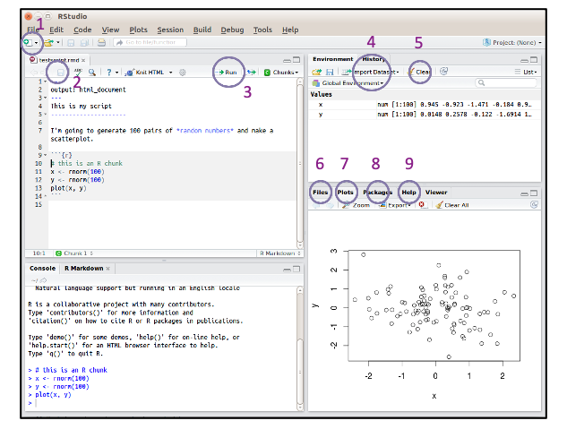
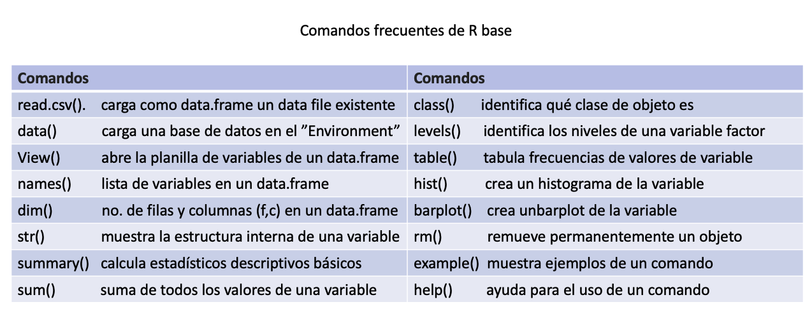
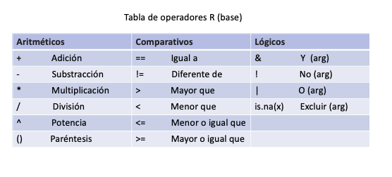
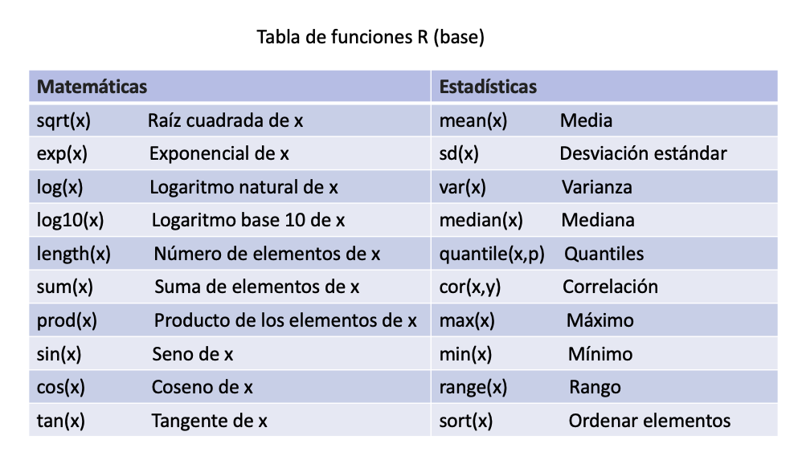

```{r setup, include=FALSE}
knitr::opts_chunk$set(echo = FALSE)
```
## Explorando RStudio

Inicialmente es importante identificar las principales herramientas que usaremos en la consola de RStudio. A continuación se encuentra una notación con sus nombres y funciones, enumeradas en la siguiente figura.

## Explorando RStudio



## Explorando RStudio

1. **New file**: Creación de un nuevo documento o directorio de trabajo en formatos como R Script, R Notebook y Rmarkdown. La ayudantía será realizada principalmente mediante documentos R Script. 

2. **Save**: Guarda los cambios del documento abierto en el panel "Edit/source."

3. **Run**: Ejecuta el código seleccionado en el panel "Edit/source."

4. **Import Dataset**: Importa el Dataset del directorio indicado.

5. **Clear**: Limpia los objetos creados en el "Environment."

## Explorando RStudio

6. **Files**: Documentos del directorio de trabajo (carpeta), dentro del disco del computador.

7. **Plots**: Visualizador de gráficos.

8. **Packages**: Buscador de descarga de librerias y repositorios R.

9. **Help**: Interface de ayuda respecto a la sintaxis y librerias de R.

## Librerías

Una librería de R es un conjunto de funciones y bases de datos encapsuladas en un objeto. Estas funciones nos permiten **utilizar distintas técnicas de estimación estadísticas, descargar bases de datos, graficar funciones, manipular bases de datos y obtener tablas de resultados.**


## Librerías

Hay al menos **3 opciones** para instalar una librería en RStudio.

• Ejecutar el comando en el panel "Edit/source": install.packages("nombre de la librería de interés").

• En la pestaña "Tools" de RStudio: Tools -> Install Packages -> escribir el nombre de la librería.

• En el panel "Assistance": Packages -> Install -> escribir el nombre de la librería.

Una vez instalado la librería, la puedes cargar en el panel de "Edit/source" con el comando **"library(nombre)"**


## Objetos

• R es un lenguaje de programación orientada a objetos. De este modo, su sintaxis define como objeto a **una estructura que tiene asociadas atributos.** Desde el punto de vista estadístico, las bases de datos son objetos donde las variables corresponden a sus atributos.

• Parte de la flexibilidad y virtud de este lenguaje de programación es que es posible guardar en objetos distintos tipos de estructuras. Un objeto puede ser un **vector (secuencia de atributos numéricos), un factor (secuencia de atributos categóricos), un conjunto de vectores y factores (base de datos), una función matemática, un modelo estadístico, una tabla de resultados, y un gráfico entre otros.** 

• A lo largo del curso estaremos revisando y manipulando distintos tipos de objetos.

## Objetos

La asignación de un valor a un objeto mediante el código en el panel "Edit/source", y su creación dentro del panel de "Environment", se realiza con los signos **<-** o con **=**, de la siguiente forma.

```{r echo=TRUE}
 
objeto1 <- 1
objeto2 <- "Urbano"

objeto3 = 1
objeto4 = "Urbano"
```

Note que a la izquierda queda el objeto creado bajo el nombre escogido, y a la derecha sus atributos.

## Objetos

Cuando nuestros objetos contienen **más de 1 atributo**, sean estos numéricos o categóricos, la creación del objeto deberá seguir la siguiente sintáxis que **separa los atributos mediante comas** y **engloba los componentes entre paréntesis.**

```{r echo=TRUE}
 
vector <- c(1,2,3,4,5,6)
factor <- c("Artes Visuales","Música","Teatro","Danza")
```

Así, nuestros objetos serán las variables, que podrán ser variables continuas numéricas (**vectores**) o categóricas (**factores**).


## Objetos - Ejemplo 1

A continuación se realizaremos un breve ejercicio de creación de objetos (variables) y una pequeña base de datos (data.frame).

```{r echo=TRUE}
# Creación de objetos variables

id <- c(50010,50020,50030,50040,50050,50060,50070) 

ingreso <- c(500, 500, 250, 1000, 500, 800, 500)

edad <- c(19,31,22,57,81,18,47)

zona <- c(rep("urbano", 4), rep("rural", 3)) 

sexo <- c(rep("hombre", 3), rep("mujer", 4))

gusto <- c("Teatro","Cine","Teatro","Musica","Cine","Musica","Cine")
```


## Objetos - Ejemplo 1

```{r echo=TRUE}
# Creación base de datos utilizando "data.frame"

datos <- data.frame(ID = id,
                    ING = ingreso, 
                    ED = edad, 
                    ZON = zona, 
                    SEX = sexo,
                    GUS = gusto)
```

## Objetos - Comandos


## Objetos - Comandos

Exploremos ahora alguno de los comandos más comunes en la manipulación de objetos utilizando nuestro data.frame ("datos"). Note que al referirnos a **variables específicas** deberemos señalar primero el **nombre del data frame ("datos"), agregar luego el signo "$", para finalmente agregar el nombre de la variable de iterés ("ED")**
 

```{r echo=TRUE}
names(datos)
```

## Objetos - Comandos

```{r echo=TRUE}
dim(datos)
str(datos$ED)
summary (datos$ING)
```

## Objetos - Comandos
```{r echo=TRUE}
class(datos$ZON)
levels(datos$GUS)
table(datos$SEX)
```


## Objetos - Operadores



## Objetos - Ejemplo 2

Los operadores constituyen la base de la sintaxis matemática de R, lo que en términos simples vuelve al software en una calculadora de alto potencial. Las operaciones simples y lógicas pueden ser también resueltas en el panel "Edit/source".

```{r echo=TRUE}
#Operadores Aritméticos
##Cálculo de promedio curso con 4 notas

(4.5+5.6+6.4+7.0)/4
promedio <- (4.5+5.6+6.4+7.0)/4
promedio 
```

## Objetos - Ejemplo 2

```{r echo=TRUE}
#Operadores Aritméticos
##Cálculo de cuadrado de binomio

c <- 13.457
d <- (6.72^3)
cbinomio1 <- (c+d)^2
cbinomio2 <- (c^2)+(2*c*d)+(d^2)
cbinomio1
cbinomio2

```

## Objetos - Ejemplo 2
```{r echo=TRUE}
#Operadores Comparativo-Lógicos

cbinomio1 > cbinomio2
cbinomio1 < cbinomio2
cbinomio1 != cbinomio2
```


## Objetos - Funciones


## Objetos - Funciones

Los funciones de cálculo matemático son cruciales para la estimación y análisis de datos estadísticos, y por ello es crucial también conocer su uso en R.

## Objetos - Ejemplo 3
```{r echo=TRUE}
#Funciones Matemáticas

sqrt(c)
exp(d)
log(cbinomio1)
log10(cbinomio2)
```

## Objetos - Ejemplo 3
```{r echo=TRUE}
#Funciones Estadísticas

mean(datos$ING)
max(datos$ED)
min(datos$ED)
range(datos$ED)
```


## Consejos

1) El aprendizaje de R es como la práctica de un instrumento musical, entre **mayor dedicación y frecuencia de práctica mejor será la adaptación al programa, su uso y fluidez.** Recomendamos explorar RStudio y el lenguaje R todas las semanas para apoyar el aprendizaje progresivo. 

2) Al ser parte de una **comunidad académica internacional**, muchas de las dudas que puedas tener en el camino son y han sido discutidas en múltiples recursos de internet como **blogs, foros, y tutoriales** que dan soluciones múltiples a un mismo problema. A modo de apoyo es recomendado consultar los recursos disponibles en internet además del material de ayudantías y consultas del curso. 


