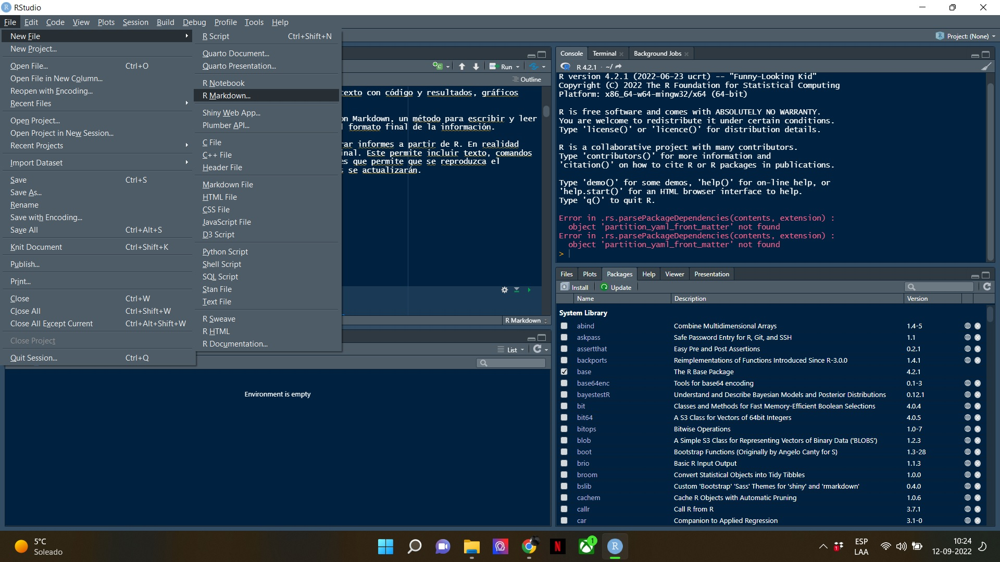
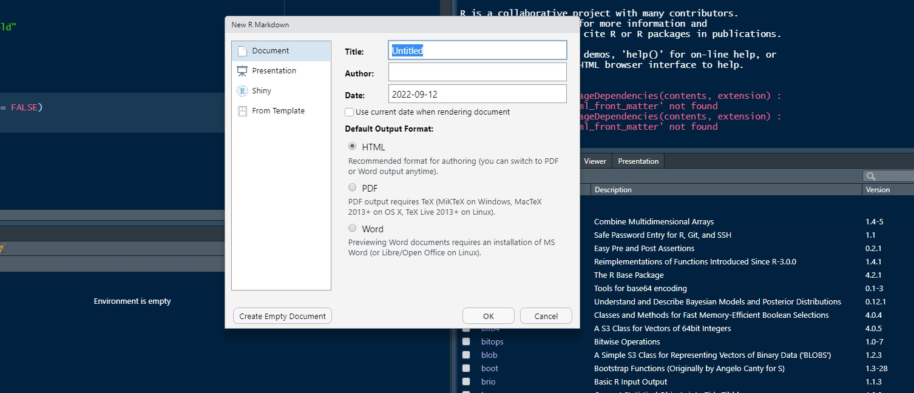
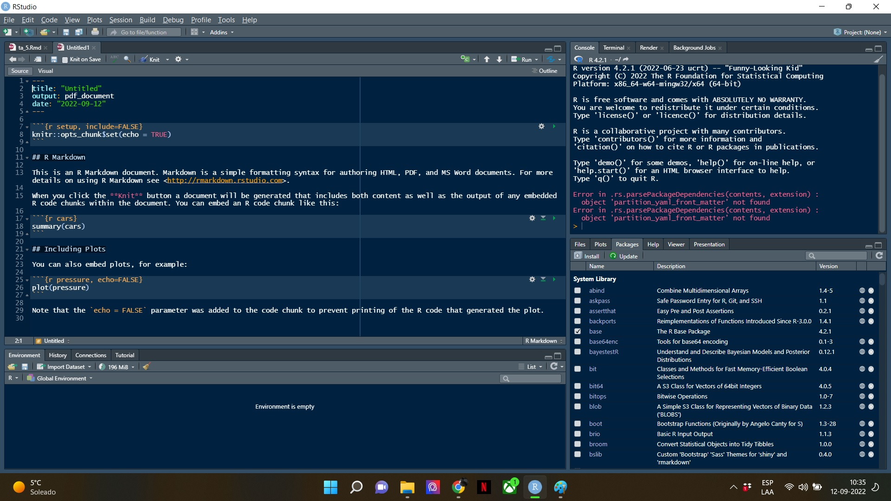

```{r setup, include=FALSE}
knitr::opts_chunk$set(echo = FALSE)

```


## Contenido

 1. R markdown
 
 2. LPM


## Rmarkdown

Rmarkdown permite la creación de informes estáticos que combinan texto con código y resultados, gráficos incluídos, generados con R. 

Es la función que vincula el lenguaje open source de R Software con Markdown, un método para escribir y leer de forma rápida en texto plano sin necesidad de preocuparse por el formato final de la información.

Una de las grandes ventajas de usar Rmarkdown es que permite generar informes a partir de R. En realidad utiliza un lenguaje llamado Markdown para enriquecer el informe final. Este permite incluir texto, comandos de R, imágenes y gráficos a un documento. Pero lo más importante es que permite que se reproduzca el análisis realizado y si se incorporan nuevos datos, los resultados se actualizarán.


## Rmarkdown

Cómo comenzar?

**Tipo de docuneto markdown**





## Rmarkdown
Existen distintos formatos en los cuáles se puede trabajar un formato Markdown. La opción por defecto es crear un documento de texto en html, word o pdf (que son los más utilzidos). Las otras opciones son crear una presentación, un archivo shiny (esta es una clase especial de archivo que permite generar “apps” que se ejecutan a través de un navegador web en un ordenador o dispositivo móvil), o usar una plantilla (template) predefinida.




## Rmarkdown


1. La cabecera: como vemos, la plantilla comienza con una cabecera limitada por tres guiones (- - -) por encima y por debajo, donde figuran el título del documento, el autor, la fecha y el formato de salida (html en este caso). En esta cabecera se pueden incluir otras instrucciones para especificar otros formatos de salida, el aspecto de la salida (colores, tamaño de letra), etc.
 

2. Los chunks: son las cajas grises que contienen código R. Estas cajas están enmarcadas por tres acentos graves (```)al inicio y al final. En la primera linea de la caja, junto a los tres acentos y entre llaves se puede asignar un nombre a cada chunk, así como diversas opciones sobre el comportamiento del mismo. Así, por ejemplo, la opción echo=TRUE indica que el contenido de chunk se muestra en la salida, y echo=FALSE que no se muestra.
 

3. El texto: se escribe directamente en el editor sobre el fondo blanco. Para dar formato al texto se usan una serie de marcas. Así por ejemplo, un hashtag (#) indica que el texto que viene a continuación es un título de primer nivel. Dos hashtags (##) indican un título de segundo nivel. Un texto que se encierre entre parejas de asteriscos (dos asteriscos delante y dos detrás) se muestra en negrilla. Un solo asterisco indica cursivas. En este enlace podemos ver un resumen en español del lenguaje markdown.


## Rmarkdown



## LPM


El modelo lineal de probabilidad, se puede interpretar en términos probabilísticos, en el sentido de que un valor concreto de la recta de regresión mide la probabilidad de que ocurra el hecho objetivo de estudio. Es decir, nuestra variable dependiente se puede considerar como la estimación de la probabilidad de que ocurra el hecho objetivo de estudio Yi = 1 siguiendo el siguiente criterio: Valores próximos a cero se corresponde con una baja probabilidad de ocurrencia del hecho estudiado (menor cuanto más próximos a cero); mientras que a valores próximos a uno se les asigna una probabilidad elevada de ocurrencia (mayor cuanto más próximos a uno).

$$y_{i} = \beta_{0} + \beta_{1}x_{1i} + \dots \beta_{k}x_{ki} + e_{i}$$

El modelo de regresión más simple aplicado a datos categóricos es el modelo lineal de probabilidad (LPM).  Esto es básicamente lo mismo que un modelo de regresión lineal.

*Variable dependiente = intercepto + predictores + error aleatorio*


## LPM

Revisemos los mismos datos de la ayudantía anterior para crear un modelo de regresión lineal en base a predictores que revisamos

``` {r echo=FALSE,include=FALSE}
#Subset base de datos OCS
load(url("https://github.com/mebucca/cda_soc3070/raw/master/ta/ta_4/data_OCS.Rdata?raw=true"))
library(ggplot2) # cargamos la librería que vamos a utilizar
library(tidyverse)

```

```{r echo=TRUE, comment='#'}

head(df1)

```

## LPM

La regresión lineal que vamos a construir la haremos sobre la base de la pregunta acerca del tipo de control policial que realizan las policías (Control negociado o control violento de la protesta) en el caso de las manifestaciones sobre educación en Chile para los años 2009-2019. Para realizar esto, utilizaremos como variable dependiente la acción policial y variables independientes: grupos sociales estudiantes, demandas sobre educación y tipo de protesta disruptiva.

```{r echo=TRUE, comment='#'}
str (df1) # siempre importante revisar la estructura de las codificaciones
# la interpretación es más intuitiva dejando todo en 0 y 1
```


## LPM

Creamos un subset de datos que contenga solo aquellos casos en que existe acción policial. Así mismo, y de acuerdo a lo que observamos previamente en la estructura de los datos, recodificamos las variables de interés para colocarlas en nuestra regresión.

Para efecto de la regresión que modelaremos la función de un control violento de la protesta respecto de un control negociado. Por lo tanto, es importante que el control negociado de la protesta=0 y control violento de la protesta=1 (consideren lo dicho previamente respecto del sentido del efecto que queremos estimar)

```{r echo=TRUE, comment='#'}

df2 <- df1 %>% select(apolicial,educacion,estudiantes,,disruptiva) %>%
  mutate(apolicial = if_else(apolicial=="Violencia Policial",1,0),
         educacion = if_else(educacion=="Sí",1,0),
                  estudiantes= if_else(estudiantes=="Sí",1,0),
         disruptiva = if_else(disruptiva=="Sí",1,0))  %>%
  mutate(apolicial = as.numeric(apolicial),
         educacion = as.numeric(educacion),
                 estudiantes = as.numeric(estudiantes), 
         disruptiva = as.numeric(disruptiva))  %>%
  na.omit(df2)
```


## LPM

```{r echo=TRUE, comment='#'}
#Modelo de regresión propuesto
lm1 <-lm(apolicial ~ educacion + estudiantes + disruptiva, data=df2)
summary(lm1)
```


## LPM

**Interpretación**

recordemos..

$$y_{i} = \beta_{0} + \beta_{1}x_{1i} + \dots \beta_{k}x_{ki} + e_{i}$$

Entonces decimos que el efecto de $x_{k}$ sobre $y$ es $\beta_{k}$. ¿Qué significa?


"Un cambio en $\Delta$ unidades de $x_{k}$ se traduce en un cambio en $\Delta$ $\beta_{k}$ unidades en el valor esperado de $y_{i}$"


## LPM


**Lectura de coeficientes**

1- Efecto de educación sobre control violento de la protesta:

**R:** En promedio, la presencia de demandas por educación disminuye la probabilidad de un control violento de la protesta en 0.009, es decir, la presencia de demandas educativas durante la protesta disminuye un 9% controlando por el resto de la covariables del modelo. Sin embargo, este efecto no es significativo.

2- Efecto de la presencia de estudiantes sobre control violento de la protesta:

**R:**En promedio, la presencia de estudiantes durante una manifestación aumenta la probabilidad de un control violento de la protesta en 0.14, es decir, la presencia de estudiantes aumenta un 14% controlando por nuestras covariables del modelo. Este efecto es estadísticamente significativo a un 99,9% de confianza  y un valor *p*= 8.42e-11

3- Efecto de tácticas disruptivas sobre el control violento de la protesta:

**R:**En promedio, la presencia de tácticas disruptivas durante la protesta aumenta la probabilidad de un control violento de la protesta en 0.06, es decir, la presencia de tácticas disruptivas aumenta un 6%, controlando por el resto de la covariables del modelo. Este efecto es estadísticamente significativo a un 99,9% de confianza y un valor *p*= -7.03e07


## LPM

*Limitaciones...*

**Distribución y rango**: Los modelos de regresión lineal asumen que la variable dependiente son manifestaciones de distribuciones normales, pero que ocurre cuándo nuestras observaciones no son normales (toma valores 0 y 1). Esto puede provocar que nuestras estimaciones escapen de los rangos 0 y 1 (que son el rango natural de una probabilidad). 


**Sesgados e inconsistentes**: Coeficiente no da en el blanco y además consistentemente convergen en un valor erróneo. 

**Varianza**: Supuesto de varianza constante en caso de las regresiones lineales no se cumple para variables categóricas = $p_i (1-p_i)$ Sabemos que usar una variable Bernoulli o Binomial no tiene varianzas constantes dada la distribución que tienen los datos. 

